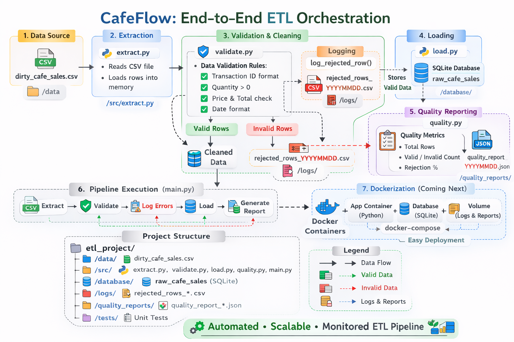

# ☕ CafeFlow: End-to-End ETL Orchestration

A production-style ETL pipeline that transforms messy cafe sales data into clean, reliable information through validation, error logging, and quality monitoring.




---

## 📋 Overview

CafeFlow simulates how real companies process raw data safely. It takes messy CSV sales data and:

- ✅ Validates each record against 6+ quality checks
- 📝 Logs rejected rows with detailed error tracking
- 💾 Loads only clean data into PostgreSQL
- 📊 Generates quality reports for observability
- 🐳 (Coming soon) Dockerized for portable deployment

---

## 🛠️ Tech Stack

| Component | Technology |
|-----------|------------|
| **Language** | Python 3.8+ |
| **Database** | PostgreSQL |
| **Libraries** | psycopg2, pandas, csv |
| **Logging** | Custom CSV logging |
| **Reporting** | JSON format |
| **Container** | Docker (in progress) |

---

## 🚀 Quick Start

### Prerequisites
- Python 3.8+
- PostgreSQL 13+
- Git

### 1. Clone the Repository
```bash
git clone https://github.com/Noman1461/DE-projects.git
cd DE-projects/etl_project

### 2. Set Up Virtual Environment
```bash
python -m venv .venv
source .venv/bin/activate  # On Windows: .venv\Scripts\activate
```

### 3. Install Dependencies
Create a `requirements.txt` file:

```
psycopg2-binary
pandas
```

Then install:

```bash
pip install -r requirements.txt
```

### 4. Configure Database
Create a `config.py` file from template:

```bash
cp src/config.template.py src/config.py
```

Update with your credentials:

```python
DB_CONFIG = {
    "host": "localhost",
    "database": "sales_db",
    "user": "your_username",
    "password": "your_password",
    "port": 5432
}
```

### 5. Create Database Table
```sql
CREATE TABLE cafe_sales_clean (
    transaction_id VARCHAR(50) PRIMARY KEY,
    item VARCHAR(100),
    quantity INT,
    price_per_unit NUMERIC,
    total_spent NUMERIC,
    payment_method VARCHAR(50),
    location VARCHAR(50),
    transaction_date DATE
);
```

### 6. Add Your Data
Place your CSV file in the `data/` folder. The pipeline expects a file named `dirty_cafe_sales.csv` with columns matching the validation rules.

### 7. Run the Pipeline
```bash
python src/main.py
```

## 📊 Pipeline Steps

1️⃣ **Extract**  
Reads raw CSV data from `data/dirty_cafe_sales.csv` (7,000+ records, scalable to 100k+)

2️⃣ **Validate**  
Each row undergoes 6+ quality checks:

- ✅ Transaction ID format (TXN_XXXXXXX)
- ✅ Quantity > 0
- ✅ Price Per Unit > 0
- ✅ Total Spent = Quantity × Price Per Unit
- ✅ Valid date format (YYYY-MM-DD)
- ✅ Missing fields → "UNKNOWN"

3️⃣ **Log Rejected Rows**  
Invalid rows are saved to `logs/rejected_rows_YYYYMMDD.csv` with:

- Original data
- Error message
- Run ID
- Timestamp

4️⃣ **Load Clean Data**  
Valid rows are inserted into `cafe_sales_clean` table with ON CONFLICT handling to prevent duplicates.

5️⃣ **Generate Quality Report**  
A JSON report is created in `quality_reports/` showing:

```json
{
  "valid_rows": 1234,
  "invalid_rows": 234,
  "total_rows": 1468,
  "rejection_rate_percentage": 15.9,
  "run_timestamp": "20260228_143022"
}
```

## 📁 Project Structure

```
etl_project/
├── data/                    # Raw CSV files (gitignored)
├── logs/                    # Rejected rows logs (gitignored)
├── quality_reports/         # JSON quality reports (gitignored)
├── src/
│   ├── config.py           # Database config (gitignored)
│   ├── config.template.py  # Template for config
│   ├── extract.py          # CSV extraction module
│   ├── validate.py         # Validation & logging
│   ├── load.py             # Database loading
│   ├── quality.py          # Quality reporting
│   └── main.py             # Pipeline orchestrator
├── .gitignore
├── cafeflow.png            # Architecture diagram
└── README.md
```

## 📈 Sample Output

**Console Output:**

```
Pipeline Run ID: 5f4d3a2b-1c8e-4d7f-9a6b-3c2d1e0f5a8b
Extracted 7139 rows
Progress: 1000/7139 rows processed
Progress: 2000/7139 rows processed
...

VALIDATION SUMMARY
==================================================
Run ID: 5f4d3a2b-1c8e-4d7f-9a6b-3c2d1e0f5a8b
Total rows processed: 7139
✅ Valid rows: 5980
❌ Invalid rows: 1159
Success rate: 83.8%
==================================================
✅ Loaded 5980 rows into database
```

## 🐳 Docker Support (Coming Soon)

The pipeline will be containerized for easy deployment:

- Consistent environment across machines
- One-command setup
- No dependency conflicts

Stay tuned for updates!

## 🤝 Contributing

Contributions are welcome! Feel free to:

- 🐛 Report bugs
- 💡 Suggest features
- 🔧 Submit PRs

## 📄 License

This project is licensed under the MIT License - see the LICENSE file for details.

## 📬 Contact

**Muhammad Noman Ajmal**

- GitHub: [@Noman1461](https://github.com/Noman1461)
- LinkedIn: [linkedin.com/in/nomanajmal](https://linkedin.com/in/nomanajmal)
- Email: [noman.pnec1461@gmail.com](mailto:noman.pnec1461@gmail.com)

⭐ **If you find this project useful, consider giving it a star!**
